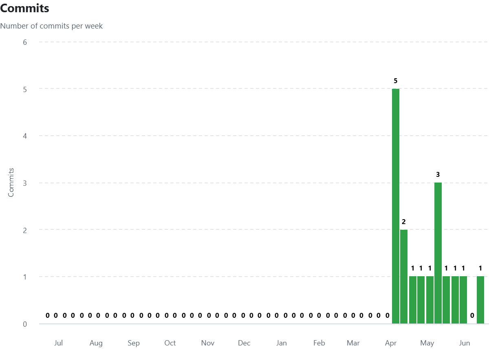

# Memory Route - 최종 발표

## 1. 게임 소개
**Memory Route**는 플레이어의 이동 경로를 기록하고, 이후 자신의 움직임을 그대로 재현하는 **'분신(Shadow)'**와 협력하여 목적지에 도달하는 **2D 퍼즐 액션 게임**입니다. 과거의 나(분신)이 현재의 나를 돕거나 방해할 수 있는 시차적 협력 메카닉이 핵심입니다.

---

## 2. 개발 계획/일정/실제 진행

## 1주차 - (100%)
- 프로젝트 초기 설정
- 기본 이동 시스템 구현 (상하좌우)
## 2주차 - (100%)
- 입력 기록 시스템 구현 (배열/리스트 저장)
- 입력 횟수 제한 기능 추가
## 3주차 - (100%)
- 분신(클론) 시스템 구현
- 입력 재생 기능 구현
## 4주차 - (100%)
- 플레이어 + 분신 동시 이동 처리
- 충돌 처리 (벽, 맵 경계)
## 5주차 - (100%)
- 퍼즐 오브젝트 구현 (버튼, 문)
- 1개 완성된 라운드 제작  
-> 완전 플레이 가능한 상태 목표
## 6주차 - (100%)
- 추가 스테이지 제작
- 퍼즐 난이도 확장
## 7주차 - (100%)
- 추가 스테이지 제작
- UI (시작/클리어 화면) 구현
## 8주차 - (100%)
- 버그 수정 및 밸런싱
- 전체 흐름 완성

---

## 3. Git Commit 자료

> **GitHub Insights 자료**

### [주별 Commit 수 통계]
| 주차 | 기간 | 커밋 수 | 주요 작업 내용 |
| :---: | :---: | :---: | :--- |
| 1주차 | 04.06 - 04.12 | 5회 | 캐릭터 상하좌우 이동 구현, 배경 및 캐릭터 스프라이트 추가 |
| 2주차 | 04.13 - 04.19 | 2회 | 입력 기록 및 이동 제한 기능 구현 |
| 3주차 | 04.20 - 04.26 | 1회 | 분신 생성 및 입력 재생 기능 구현 |
| 4주차 | 04.27 - 05.03 | 1회 | 플레이어-분신 충돌 및 맵 경계 이탈 시 스테이지 초기화 구현 |
| 5주차 | 05.04 - 05.10 | 1회 | 퍼즐 오브젝트(버튼, 사다리, 도착 지점) 구현 및 상호작용 추가 |
| 6주차 | 05.11 - 05.17 | 1회 | 2라운드 구현 |
| 7주차 | 05.18 - 05.24 | 1회 | 시작화면 및 정지 화면 구현, 1,2 라운드 통합 |
| 8주차 | 05.25 - 05.31 | 1회 | 3라운드 확장, 포탈 시스템 추가 |
| 9주차 | 06.01 - 06.07 | 1회 | 4라운드 확장, 라운드 클리어 시 화면에 클리어 표시 |
| 9주차 | 06.08 - 06.14 | 1회 | 파일 정리 및 사운드 출력 추가 |
| **합계** | | **15회** | |

---

## 4. 목표 변경 내용 및 이유
- **변경 내용**: X

---

## 5. 사용된 기술/참고한 것들/수업내용에서 차용헌 것/직접 개발한 것 

### 사용된 기술
- **언어:** Kotlin
- **프레임워크:** Android Custom View (Canvas API 기반 게임 루프)
- **멀티미디어:** SoundPool (효과음 재생), Bitmap (스프라이트 렌더링)

### 참고한 자료
- **수업 자료:** SPGP_2026 수업 GitHub
- **안드로이드 공식 문서:** View 클래스 생명주기 및 Canvas 렌더링 가이드
- **기타 자료:** chatGPT

### 수업 내용에서 차용한 부분
#### Game Loop 구조
수업에서 제공된 `GameView`의 기본 구조(`onDraw()`와 `invalidate()`를 이용한 렌더링 루프)를 차용하여 게임의 전체 프레임을 관리하였습니다.
#### 상태 패턴
`Enum`을 사용하여 `IDLE`, `RUN`, `DEATH` 등 캐릭터 상태를 명확히 정의하고, 복잡한 로직에서도 안정적으로 상태를 전환할 수 있도록 구현하였습니다.
#### 메모리 최적화
리소스를 프레임마다 반복적으로 로드하지 않고, 객체 초기화 시점에 `SoundPool`과 `Bitmap`을 메모리에 적재하는 방식을 적용하여 성능을 최적화하였습니다.
#### 타일 맵 인덱싱
2차원 공간을 1차원 배열로 평탄화하는 방식(`row * mapCols + col`)을 학습하여 맵 데이터 관리 및 충돌 판정 로직에 활용하였습니다.

### 직접 개발한 부분
#### 입력 기록 및 동시 이동 엔진
`moveHistory` 리스트를 사용하여 플레이어의 이동 입력을 기록하고, `replayIndex`를 통해 분신(Shadow)이 과거의 이동 경로를 정확하게 재현하며 플레이어와 동시에 움직일 수 있도록 구현하였습니다.
#### 퍼즐 상호작용 엔진
스위치와 포털 기능을 구현하기 위해 `isSwitchPressed` 등의 상태 변수를 설계하였으며, 특정 조건에 따라 타일의 충돌 속성이 실시간으로 변경되는 조건부 충돌 로직을 직접 개발하였습니다.
#### 안전 구역(Safe Zone) 알고리즘
게임 시작 직후 캐릭터와 분신이 겹쳐 즉시 사망하는 문제를 방지하기 위해 안전 구역 개념을 도입하였으며, 충돌 발생 시 사용자에게 상황을 인지할 시간을 제공하는 상태 지연 및 예외 처리 로직을 구현하였습니다.
#### UX 및 레벨 디자인
기기 해상도와 무관하게 일관된 플레이 경험을 제공하기 위해 `tileSize` 기반의 상대 좌표 렌더링 시스템을 구축하였으며, 특정 스테이지(예: 4라운드)의 가독성을 향상시키기 위한 UI 배치와 레벨 디자인을 적용하였습니다.

---

## 6. 아쉬운 점과 해결하지 못한 문제

### 구현하지 못한 부분
더 다양한 퍼즐 요소와 복잡한 레벨 디자인을 추가하고 싶었으나, 프로젝트 기간의 제약으로 인해 최종적으로 4개의 스테이지만 구현하였습니다. 향후에는 새로운 장애물, 상호작용 오브젝트, 분기형 퍼즐 등을 추가하여 게임의 볼륨을 확장하고자 합니다.

### 추가적으로 보완할 부분
사용자 편의성을 위한 기능이 필요합니다.
- 게임 규칙을 쉽게 이해할 수 있는 튜토리얼 화면 추가
- 게임 진행 상황을 저장하기 위한 데이터 저장 기능 구현
- Room DB를 활용한 스테이지 진행도 및 설정 데이터 관리

### 개발 과정에서 겪은 문제와 해결 방법
개발 과정에서 가장 어려웠던 문제 중 하나는 게임 시작 직후 플레이어와 분신의 위치가 겹쳐 즉시 충돌 판정이 발생하는 버그였습니다. 이는 프레임워크의 초기화 시점과 게임 로직 실행 시점이 일치하지 않아 발생한 문제였습니다.

이를 해결하기 위해 `isCollisionEnabled` 플래그를 도입하여 일정 시간이 지난 후에만 충돌 판정을 활성화하도록 구현하였습니다. 이를 통해 사용자가 게임 상황을 인지할 시간을 확보할 수 있었으며, 의도하지 않은 즉시 사망 문제를 해결할 수 있었습니다.

---

## 6. 수업에 대한 내용

### 수업을 통해 기대했던 것
본 수업을 통해 안드로이드 환경에서 게임이 동작하는 원리와 게임 엔진의 기본 구조, 그리고 모바일 애플리케이션 설계 방법을 학습할 수 있기를 기대하였습니다.

### 수업을 통해 얻은 것
수업을 통해 단순히 외부 라이브러리를 사용하는 수준을 넘어, Canvas를 이용하여 직접 게임 화면을 렌더링하고 게임 루프를 구성하는 방법을 배울 수 있었습니다.
또한 다음과 같은 내용을 깊이 있게 학습할 수 있었습니다.
- Canvas 기반 게임 렌더링 구조
- 상태 기반 프로그래밍(State Pattern)
- Bitmap을 활용한 스프라이트 렌더링
- SoundPool을 이용한 비동기 사운드 로딩 및 재생
- 객체 지향적인 게임 구조 설계
- 충돌 판정 및 이벤트 처리 로직 구현
특히 직접 게임을 제작하면서 수업에서 배운 개념들이 실제 프로젝트에서 어떻게 활용되는지 경험할 수 있었습니다.

### 아쉬웠던 점
기본적인 게임 제작 과정은 충분히 학습할 수 있었지만, 성능 최적화 기법이나 게임 밸런스 설계와 같은 실무적인 주제를 더 깊게 다뤄볼 수 있는 시간이 있었다면 더욱 좋았을 것이라고 생각합니다.

### 수업 개선 제안
수업 과정에서 구현해야 하는 기능에 대해 단계별 가이드나 난이도별 예제 프로젝트가 추가된다면 학습에 더욱 도움이 될 것이라고 생각합니다. 또한 학생들이 구현 과정에서 자주 겪는 문제와 해결 사례를 함께 공유하는 시간이 있다면 프로젝트 완성도를 높이는 데 도움이 될 것으로 생각합니다.